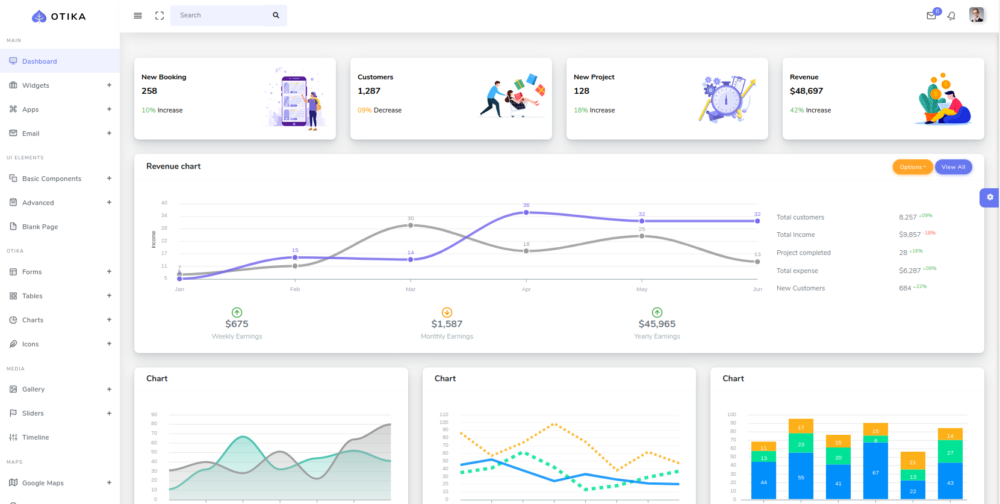

# otika-demo

Spring Boot with Thymeleaf and Otika bootstrap Admin 

# otika-demo

Spring Boot with Thymeleaf and Otika Bootstrap  Admin 

## Installation

download Otika extract to src/main/resources

## Security 

1. Spring Security
1. [Apache Siro](https://shiro.apache.org/spring-framework.html)

## Screenshot

## Convert Layout

~~~sh

$> cd src/main/resources/static
$> cp index.html ../templates/
$> cd ../templates/ 
$> cp index.html layout.html

~~~

~~~
<!DOCTYPE html>
<html xmlns="http://www.w3.org/1999/xhtml"
      xmlns:th="http://www.thymeleaf.org"
      xmlns:layout="http://www.ultraq.net.nz/thymeleaf/layout"
>

~~~

setup layout

Setup layout using index.html
~~~
        <!-- Sidebar -->
        

~~~

page
~~~
<!DOCTYPE html>
<html xmlns="http://www.w3.org/1999/xhtml"
      xmlns:th="http://www.thymeleaf.org"
      xmlns:layout="http://www.ultraq.net.nz/thymeleaf/layout"
      layout:decorator="layout">

~~~

layout.html main contetn

~~~

      <!-- Main Content -->
      

        <section class="section" layout:fragment="content">
           <!-- main content -->
        </section>
        

        
        
~~~

index.html main content
~~~
      <!-- Main Content -->
      

        <section class="section" layout:fragment="content">

~~~